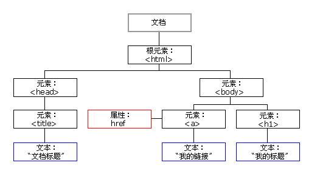

## JavaScript HTML DOM

---

通过 HTML DOM，可访问 JavaScript HTML 文档的所有元素。

---

## HTML DOM (文档对象模型）

当网页被加载时，浏览器会创建页面的文档对象模型（Document Object Model）。

HTML DOM 模型被构造为对象的树。

---

### HTML DOM树



通过可编程的对象模型，JavaScript获得了足够的能力来创建动态的`HTML`。
+ JavaScript能够改变页面中的所有`HTML`元素
+ JavaScript能够改变页面中的所有`HTML`属性
+ JavaScript能够改变页面中的所有`CSS`样式
+ JavaScript能够对页面中的所有事件做出反应

---

### 查找HTML元素

通常，通过JavaScript，你需要操作HTML元素。
为了做到这件事，必须首先找到该元素。有三种方法来找到元素
+ 通过`id`找到HTML元素
+ 通过`标签名`找到HTML元素
+ 通过`class`找到HTML元素

---

### 通过id查找HTML元素

在DOM中查找HTML元素的最简单方法，是通过使用元素的`id`
实例
查找`id="intro"`元素：
```javascript
var x=document.getElementById("intro");
```
如果找到该元素，则该方法将以对象（在x中）的形式返回该元素。
如果未找到该元素，则x将包含null。

---

### 通过标签名查找HTML元素

实例
查找`id=main`的元素，然后查找'main'中所有的`<p>`元素：
```javascript
var x=document.getElementById("main");
var y=x.getElementsByTagName("p");
```
提示：通过类名查找HTML元素在IE 5,6,7,8中无效。

